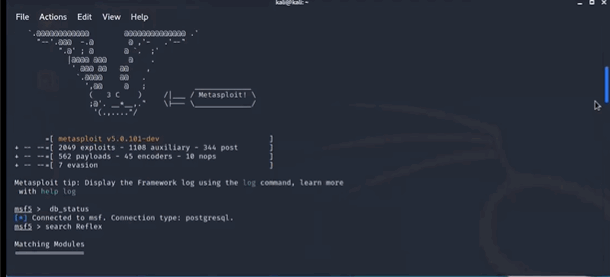
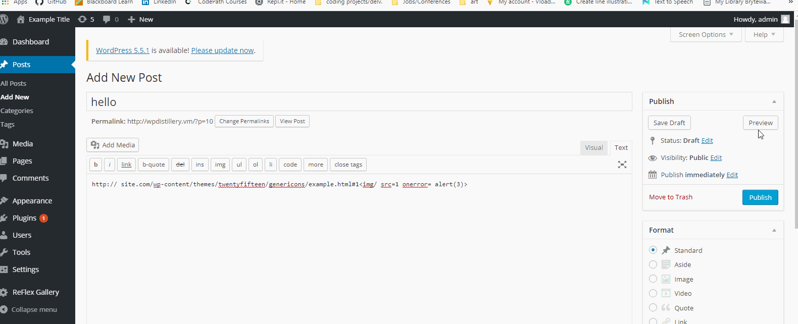
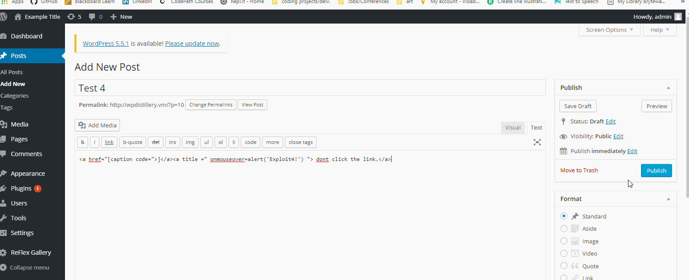

# Project 7/8 - WordPress Pentesting

Time spent: **17** hours spent in total

> Objective: Find, analyze, recreate, and document **five vulnerabilities** affecting an old version of WordPress

## Pentesting Report

### 1. (Required) WordPress Reflex Gallery User Enumeration
  - [X] Summary: 
   - Vulnerability types: User Enumeration
   - Tested in version: 4.1-4.2.1
   - Fixed in version: 4.2.2
  - [X] GIF Walkthrough: 
  - 

  - [X] Steps to recreate: 
 - Download the 3.1.3 zip file
 - Add the WordPress admin console through WP Dashboard. 
 - Once installed run "wpscan --url http://wpdistillery.vm --random-user-agent" into Kali
 [X] Affected source code: [Link 1](https://core.trac.wordpress.org/browser/tags/version/src/source_file.php)
    - 
### 2. (Required) Cross-Site Scripting
  - [X] Summary: 
   - Vulnerability types: XSS
   - Tested in version: 4.1-4.2.1
   - Fixed in version: 4.2.2
  - [X] GIF Walkthrough: 
   
  - [X] Steps to recreate:
  - Edit a new post, and insert  http:// site.com/wp-content/themes/twentyfifteen/genericons/example.html#1 and press preview.  Then 1 will pop up   - in the new window. 
  - [X] Affected source code:
    
### 3. (Required) Cross-Site Scripting 
  - [X] Summary: 
   - Vulnerability types: XSS
   - Tested in version: 4.1-4.2.1
   - Fixed in version: 4.2.2
  - [X] GIF Walkthrough: 
   
  - [X] Steps to recreate: 
  - Edit a new post, and insert  http:// site.com/wp-content/themes/twentyfifteen/genericons/example.html#1 and press preview.  Then 3 will pop up   - in the new window. 
  - [X] Affected source code:
   
### 4. (Optional) Cross-Site Scripting 
  - [X] Summary: 
   - Vulnerability types: XSS
   - Tested in version: 4.1-4.2.1
   - Fixed in version: 4.2.2
  - [X] GIF Walkthrough: 
   
  - [X] Steps to recreate: 
  - Edit a new post, and insert <a href="[caption code=">]</a><a title =" onmouseover=alert('Exploit4!') "> dont click the link.</a> in the content link. Once you click the   - link the 'Exploit4!' window will pop up. 
  - [X] Affected source code:
  https://wpscan.com/vulnerability/8111
   

## Assets

List any additional assets, such as scripts or files

## Resources

- [WordPress Source Browser](https://core.trac.wordpress.org/browser/)
- [WordPress Developer Reference](https://developer.wordpress.org/reference/)

GIFs created with [LiceCap](http://www.cockos.com/licecap/).

## Notes

Trying to configure my Kali was the hardest part of this assinment. 

## License

    Copyright [yyyy] [name of copyright owner]

    Licensed under the Apache License, Version 2.0 (the "License");
    you may not use this file except in compliance with the License.
    You may obtain a copy of the License at

        http://www.apache.org/licenses/LICENSE-2.0

    Unless required by applicable law or agreed to in writing, software
    distributed under the License is distributed on an "AS IS" BASIS,
    WITHOUT WARRANTIES OR CONDITIONS OF ANY KIND, either express or implied.
    See the License for the specific language governing permissions and
    limitations under the License.
